References
==========

Parsec Performance Test Result
------------------------------

Server Machine Spec:

    Summary:  Dell R410, 2 x Xeon E5620 2.40GHz, 23.6GB / 24GB 1333MHz DDR3, 1 x 500GB SATA
    System:       Dell PowerEdge R410 (Dell 01V648), C-2N/24/500, ySPEC 25.0
    Processors:   2 x Xeon E5620 2.40GHz, 5.86GT QPI (HT enabled, 8 cores, 16 threads) - Gulftown B1, 64-bit, quad-core, 32nm, L3: 12MB
    Memory:       23.6GB / 24GB 1333MHz DDR3 == 6 x 4GB - 4GB PC3-10600 Samsung DDR3-1333 ECC Registered CL9 2Rx8

Jetty setting:

    java_opts: -Dparsec.conf.env.context=dev.conf
    maxThreads: 500

Test Scenario:

    validation filter enable
    config file size: 2.6k

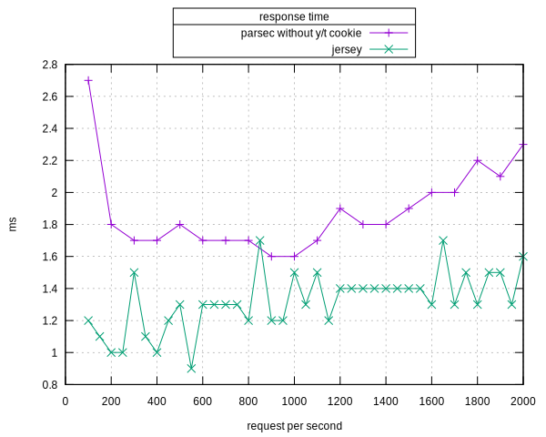

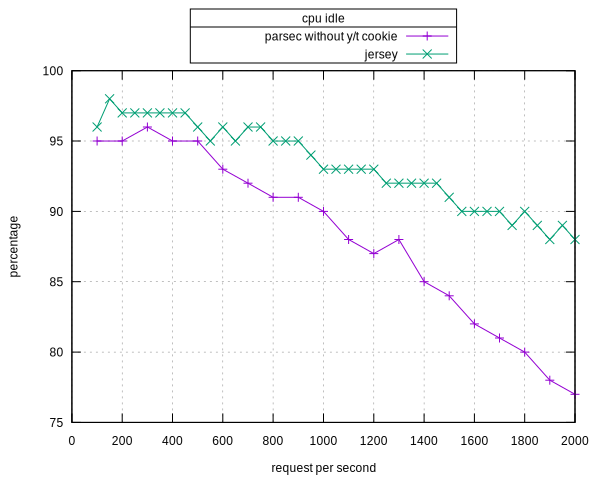

However, after turn on the cookie filter, the
performance drop dramatically.

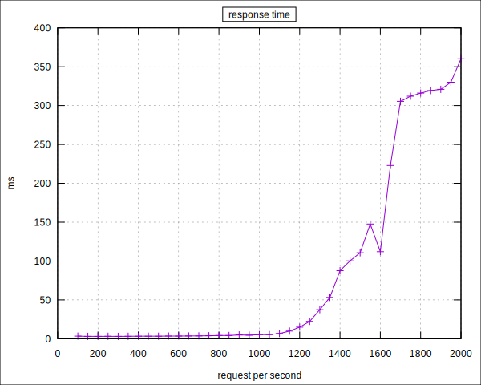

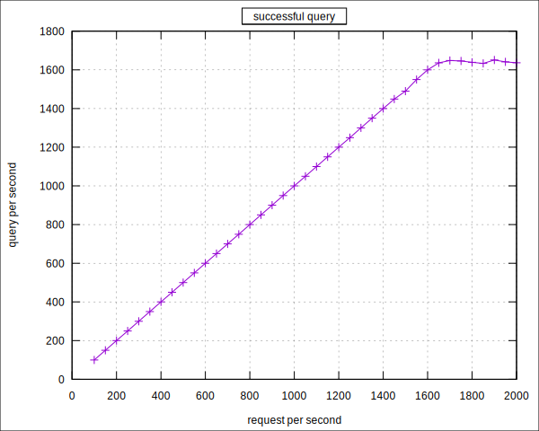

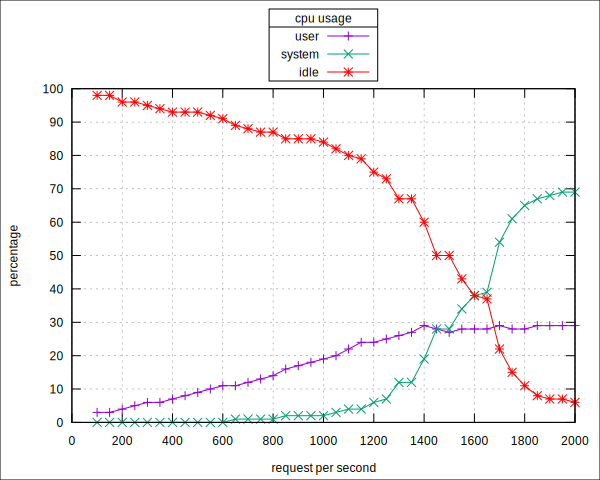

Git Repositories
----------------

### Core

> -   [parsec](https://github.com/yahoo/parsec)

### Supporting Library

> -   [parsec\-libraries](https://github.com/yahoo/parsec-libraries)

Parsec Client Performance Test Result
-------------------------------------

Client Machine Spec:

    Summary:  Dell R410, 2 x Xeon E5620 2.40GHz, 23.6GB / 24GB 1333MHz DDR3, 1 x 500GB SATA
    System:   Dell PowerEdge R410 (Dell 01V648), C-2N/24/500, ySPEC 25.0
    Processors:   2 x Xeon E5620 2.40GHz, 5.86GT QPI (HT enabled, 8 cores, 16 threads) - Gulftown B1, 64-bit, quad-core, 32nm, L3: 12MB
    Memory:   23.6GB / 24GB 1333MHz DDR3 == 6 x 4GB - 4GB PC3-10600 Samsung DDR3-1333 ECC Registered CL9 2Rx8

Server Machine Spec:

    Summary:      Dell R410, 2 x Xeon E5530 2.40GHz, 23.1GB / 24GB 1333MHz DDR3, 1 x 500GB SATA
    System:       Dell PowerEdge R410 (Dell 0N051F), C-2N/24/500, ySPEC 25.0
    Processors:   2 x Xeon E5530 2.40GHz, 5.86GT QPI (HT enabled, 8 cores, 16 threads) - Gainestown D0, 64-bit, quad-core, 45nm, L3: 8MB
    Memory:       23.1GB / 24GB 1333MHz DDR3 == 6 x 4GB - 4GB PC3-10600 Hynix DDR3-1333 ECC Registered CL9 2Rx4

Test Scenario:

    Number of client: 1
    Number of server: 1
    Response size: 1k

### Ning vs Parsec vs Parsec Status Retry Enabled

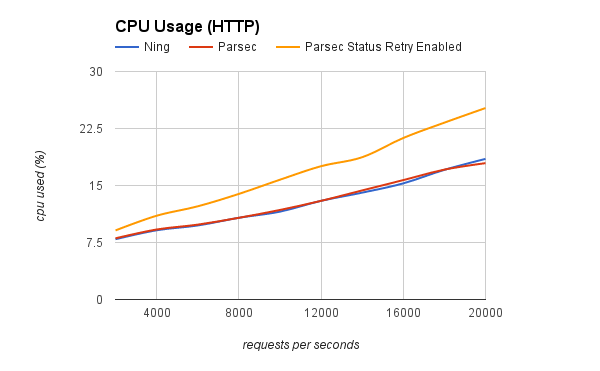

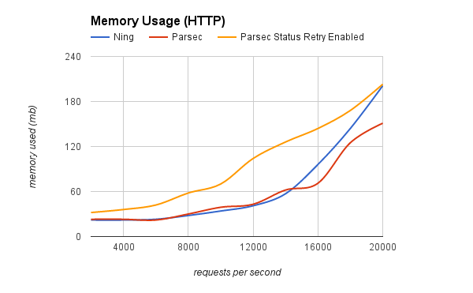

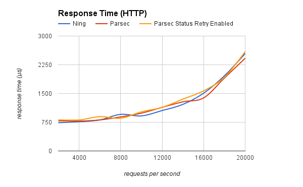

### YhdrRequestFilter

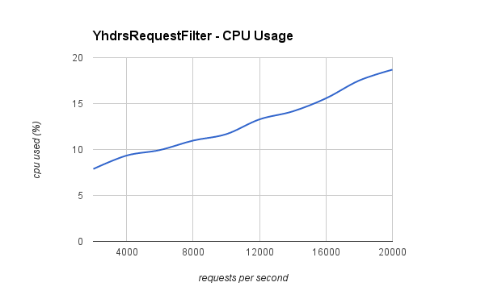

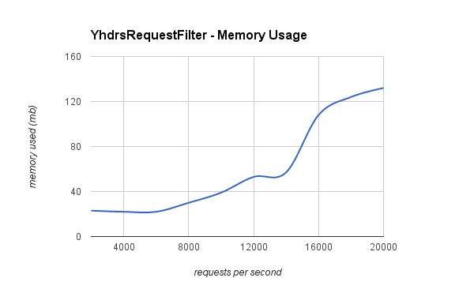

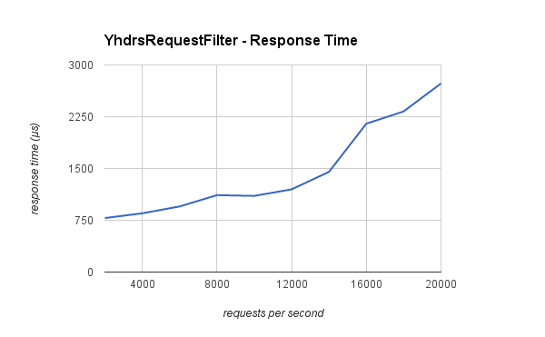

### HeaderBackpostRequestFilter

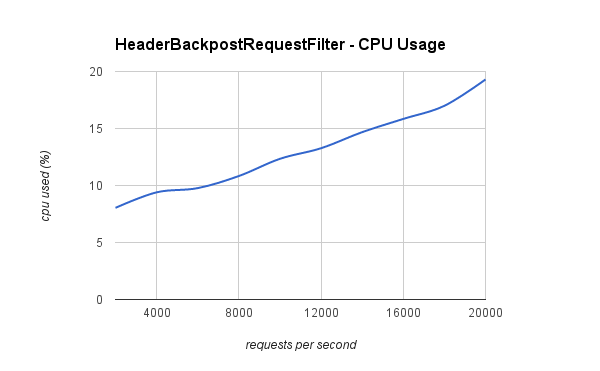

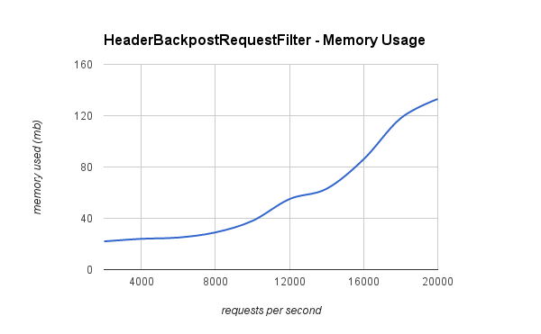

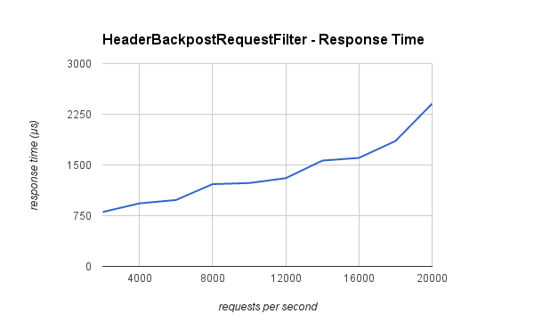

### Sequential

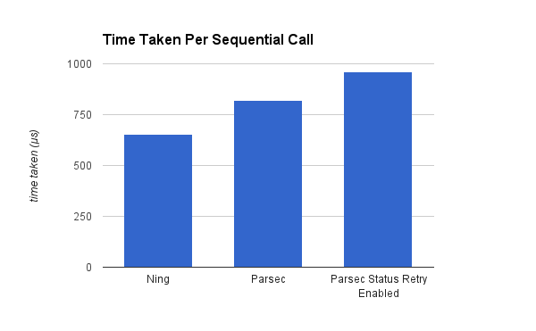

